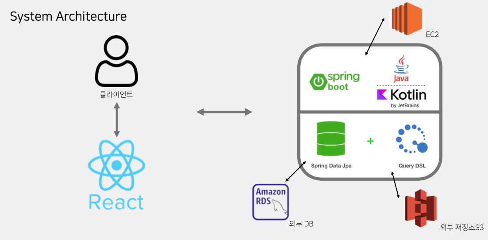

# 두커(두호 커뮤니티)

   
  
   

## 프로젝트 소개

프로젝트 개요/동기

- CRUD 기능을 구현한 커뮤니티 프로젝트
- 첫 개인 프로젝트로 FE - BE 간의 통신과 기본 지식을 얻고자 진행한 프로젝트
- 풀스택 개발

 

## 기술 스택

### Tools

|Java | Kotlin | Spring Boot |  React   |  MySQL   |
| :--------: | :--------: | :--------: | :------: | :-----: |
|   ![java]    |  ![kotlin]    | ![spring]    | ![react] | ![mysql] |

### etc
|Amazon EC2 | Amazon RDS |  Amazon S3 |
| :--------: | :--------: | :------: | 
|   ![ec2]    |   ![rds]    | ![s3] | 

 

## 구현 기능

### 게시글/댓글 CRUD, 검색, 좋아요 기능 구현
- JWT토큰을 이용한 인증 구현, refreshToken도입
### 연간 Top3게시글 추천, 최신 게시물 페이징 처리, 인기 검색어 기능 로직 구현

### Spring Data JPA + QueryDSL을 활용한 데이터 접근 기술 구현
- Spring Data JPA를 활용한 인기 검색어, 연간 Top3 게시글 추천 로직 구현, 추후 QueryDSL과 결합하여 코드 복잡도 개선
### Java to Kotlin 리팩토링 진행

### 2024 기준 새로 배운 기술들, 방법들을 활용한 다양한 기능 리팩토링
- 예외 핸들러 정의 및 구현
- ResponseEntity와 ResponseDto 병행 사용
- Dto - Entity의 확실한 구분
- 이외 다양한 리팩토링 진행중
 

## 회고
- 처음으로 온전한 서비스를 만들어본 좋은 경험이었다.
- 프로젝트를 완성한 이후에도 조금씩 변형도 해보고 리팩토링도 해볼 수 있는 기회였다.
- Jmeter를 활용한 트래픽 발생 후 서버의 상태를 관제해볼 수 있었다.

 

## 개발 일정

개발 일정

### 2023-07-01
- 요구사항 정리 및 SQL 작성

### 2023-07-05
- 기본적인 구조 완성(로그인)

### 2023-07-10
- 로그인 기능 구현(JWT)
- 완전한 구현은 X

### 2023-07-12
- 로그인 기능 까지의 페이지 구현(React)

### 2023-07-15
- 개인정보 수정 로직, 주간 TOP3 게시물 로직, 최신 게시물 로직 구현

### 2023-07-17
- 개인정보 페이지 구현

### 2023-07-20
- 페이지 디자인 재구성

### 2023-07-24
- 게시물 상세 페이지 구현 및 연결 완료

### 2023-07-25
- 댓글 기능, 좋아요 기능 구현

### 2023-07-26
- 게시물, 댓글, 좋아요 삭제 로직 구현
- api 분리(React)
- 프론트 실시간 반응 처리(댓글,좋아요 등 *아직 미완)
- 검색 페이지 구현중

### 2023-07-27
- 검색 기능 구현
- 인기 검색어 기능 구현

### 2023-07-31
- 파일(게시글 사진, 동영상, 기타 파일, 프로필 사진)업로드 구현중

### 2023-08-01
- 파일 업로드/조회 구현 완료
- 프로필 사진 구현
- 게시물 수정 구현(파일 제외)

### 2023-08-02
- 동영상 업로드/조회 구현
- 페이지 디자인 재구성
- 댓글 수정 구현

### 2023-08-03
- 페이지 디자인 재구성
- 좋아요 로직 수정
- 조회수가 계속 증가하는 문제 해결

### 2023-08-04
- 파일 다운로드 구현(어떤 파일이던)
- 이미지 로딩 방식 변경(blob)
- 동영상 로딩 구현중(blob)

### 2023-08-05
- 동영상 로드 구현
- 검색/댓글 프로필사진 로드 방식 변경

### 2023-08-06
- 페이지 디자인 수정
- 파일 다운로드 시 파일명이 지정 안되는 문제 해결
- 불필요한 의존관계 정리

### 2023-08-07
- 로그인 방식 변경
- 기존은 그냥 jwt토큰만 이용 -> refresh토큰 활용(적용중)

### 2023-08-08
- refresh토큰을 활용한 로그인 로직 적용 완료
- 좋아요 로직 개선
- 기본 프로필 제공

### 2023-08-09
- 로그인 로직 변경에 의한 오류 해결
- refreshToken 관련 로직도 불필요한 요청이 많아보여 수정 예정
- 토큰 저장방식 변경(localStorage / 보안 이슈 차차 해결할 예정)
- 메인 디자인좀 구상해볼 예정

### 2023-08-14
- 반복되는 패턴 일반화(진행중)

### 2023-08-15
- 저장소 변경(로컬 -> aws_s3)
- 배포(aws-ec2,rds)

### 2023-08-16
- 배포 완료
- 좋아요 개수 음수로 나오는 버그 수정 / 댓글창 댓글 내용 남아있는 버그 수정

# 2023-11-10
- Kotlin으로 리팩토링(추가)

## 2023-11-13
- Spring Data JPA + QueryDSL 활용 * 긴 쿼리의 가독성 해결

### 2024-01-25
- 추가 리팩토링을 위한 코드리뷰 진행중

### 2024-01-30
- 비효율적이고 잘못 짜왔던 코드들에 대한 리팩토링 진행할 예정
  - 삭제 로직: cascade와 oneTomany 등의 관계형 DB를 활용한 리팩토링을 진행할 예정 -> 기존에 개편한 삭제 로직은 사라질 예정
  - 도메인: 현재 연관성을 단순히 '게시글 작성자 이름' 과 같은 형식으로 사용자와 게시글,댓글,검색어,좋아요 로직 등이 연계돼있는데 이를 개편할 예정
- 꽤 오랜 시간이 걸릴듯 함

### 2024-01-31
- 모든 도메인의 생성자에 직접 접근했던 방법에서 팩토리 메소드를 통한 접근으로 방식 변경
- 모든 도메인은 Dto를 통해 주고받아지며, 이에 따른 record Dto로 변경
- 현재 게시글 - set<Comment> 잘 가져와지는지 확인 및 댓글 잘 가져와지는지 확인
- 게시글 - 댓글 간의 무한 참조 바인딩 문제로 인한 @JsonIgnore 어노테이션 추가
  - 왜 이게 생기는지 고민해볼 필요가 있음

### 2024-02-01
- 좋아요 로직 기능 수정 -> 이전 커밋에선 비활성화 했었음
- LikeDto 와 BoardDto 변환간 무한 재귀 호출 문제 발생
  - -> LikeDto에선 게시글의 id와 사용자 이메일만 사용하는 것으로 방법 수정
  - 좋아요 로직 하나로 통일하여, 좋아요가 있다면 지우고 없으면 좋아요를 만드는 형식으로 변경
- 게시글 수정, 작성, 좋아요 등록 취소 등 구현 테스트 완료
- 검색어 기능 구현 완료
- 이미지 url 가져오는 부분 구현 완료
TODO: 게시글 정보 가져올 때 좋아요 정보도 함께 가져올 수 있도록 DTO 수정 후 좋아요 갯수, 댓글 수 등 파악할 수 있어야함

### 2024-02-02
- 예외 핸들러 추가.
  - 기존 그냥 실패 처리만 했던 로직들에 예외 처리와 로그를 전달하면서 예외 처리 기능 구현
- 문제는, ResponseEntity 대신 ResponseDto를 사용함에 따라 클라에서 200ok의 응답만 받음.개인 프로젝트라서 상관 없다고 생각하는데. 어떻게 처리할지 고민
  - -> 타 프로젝트에선 ResponseEntity를 활용했는데, 이게 실패 처리도 유연하고 더 좋은 방법같긴함.
- 백엔드 API 테스트 완료
- 현재 동영상, 이미지, 파일 등이 null 처리가 돼있을때 s3url/null 로 요청이 가고 이는 문제가 됨.
  - 애초에 null값이면 요청을 안하도록 수정해야함
  - -> 이는 이미 백엔드에 구현이 돼있는데 왜 그런지 모르겠음. 수정 필요
- 프론트엔드 이상 사항 많음
- 변경사항을 반영해서 간단하게 View 송출까진 테스트 완료
  - 좋아요 개수 잘 안보이는 문제, 게시글 좋아요 누를 시 게시글 세부사항 refresh 이슈  등 해결할게 많음

### 2024-02-03
- 좋아요 개수, 댓글 개수 못 읽어왔던 버그 수정
- 게시글 이미지, 프로필 사진 등 사진 이름 사용자 설정을 통해 가져오던 방식에서 db에 s3 url 추가한 후 클라이언트에서 바로 접근하는 방식으로 변경
  - 파일 다운로드는 기존 방식 이용하려고 하는데 잘 동작하지 않음. 해결 필요
- 방식으로 변경한 후 이전에 겪었던 동영상 분할 로딩 문제가 발생.
  - 실시간 스트리밍이 불가능하고 영상에 접근, 다운로드는 가능하지만 게시글에서 재생이 불가능함 -> 해결 필요

### 2024-02-06
- 게시글에서 직접 s3 url을 가져옴에 따른 파일 관련 api 삭제,
- 아직 파일, 동영상 관련 오류는 해결하지 못함.
  - 동영상은 접근은 가능하지만 206 응답으로 분할되어 영상이 보내져 영상 스트리밍이 되지 않고 파일은 다운로드가 불가능.
  -  스트리밍 방법은 찾아보고 파일은 blob형식으로 받을 수 있도록 변경해야할 것 같다.

### 2024-02-08
- 응답 형식 변경
  - 기존은 ResponseDto를 활용해서, 실패 시 실패 코드 등 전달을 못했음
  - ResponseEntity를 활용하되, 메시지와 데이터를 분할해서 전달함으로 어떤 이유로 실패했는지 전달할 수 있도록 변경
  - 프론트측 변화 최소화하기위해 서버 단에서 감싸서 전달

<!-- Stack Icon Refernces -->

[java]: /images/stack/java.png
[kotlin]: /images/stack/kotlin.svg
[spring]: /images/stack/springboot.png
[react]: /images/stack/react.png
[mysql]: /images/stack/rds_mysql.png
[ec2]: /images/stack/ec2.png
[rds]: /images/stack/rds.png
[s3]: /images/stack/s3.png
